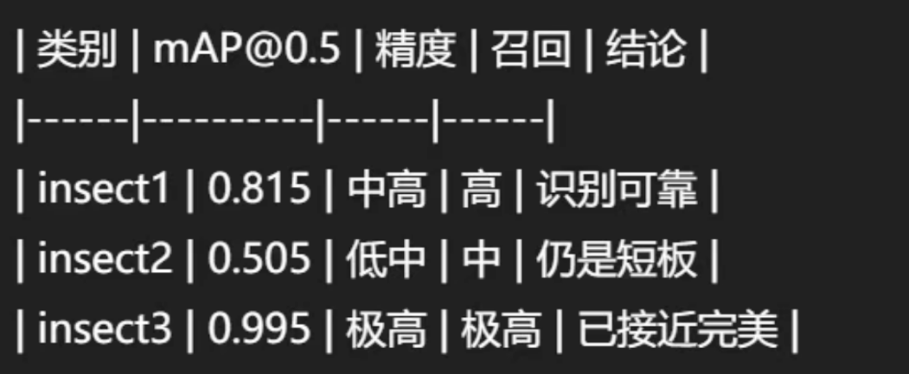

# Marine-Organism-identification

Under the guidance of my supervisor, Dong Shuaishuai, I have conducted a preliminary study on marine organism identification.

## Stage one
有关three_c文件：此处txt文件夹是拍摄的图片和处理后对应的标签，考虑到原始数据的冗杂/实际拍摄很难做到只有一类生物等客观原因，我们对于每种生物人工大概选择了1000个样本。

### 训练
- 分别才用yolo v5 v8 v11家族进行训练
- 本机笔记本4060训练，借用了某服务商的GPU进行加速。
- 大概可以接受训练速度，若增加样本需要更大的算法需求。

### 初步直接训练结果
- yolov11模型综合最好(当然了)

- 结果来看QS文件夹表现较差，初步推测是因为原始照片分别对一类生物实验染色前后分别进行拍照导致的误差(在初步训练中未考虑色差等量纲)，其余两类表现良好。待后续进行优化。
